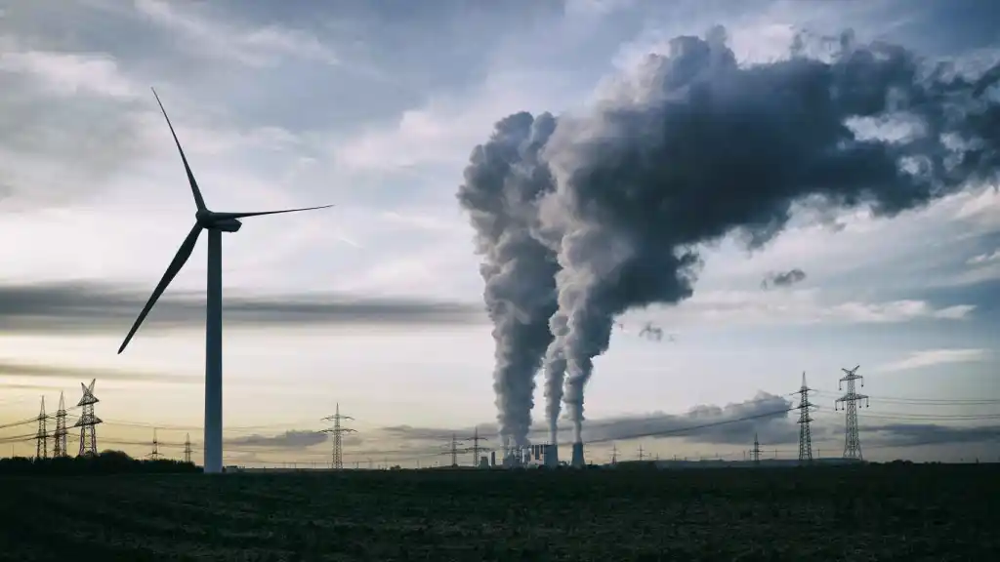

## Participación De Las Empresas

Para las **organizaciones empresariales** la sostenibilidad ambiental solo tiene ventajas. Por ejemplo, adherirse a compromisos de sostenibilidad ambiental genera racionalidad en la gestión. Las empresas que aplican medidas de sostenibilidad ambiental generan imagen de marca y prestigio. Además, al cumplir las normativas medioambientales se logra evitar incurrir en delitos, sanciones, multas o demandas y es más fácil colocarse en una buena posición frente a posibles subvenciones y recursos financieros.

## Algunas empresas que apuestan por el Desarrollo Sostenible

### UNILEVER

Esta es de las empresas con desarrollo sostenible que es necesario mencionar e incluir en nuestra lista. Creó y lanzó su estrategia de desarrollo sostenible en el año 2010 (el Plan de Vida Sostenible). Con este, conectó su línea de negocio con el respeto al medio ambiente.

Este año, la empresa ha entrado a formar parte del Plan de Economía Circular que gestiona CANIPEC, en México.

Para conseguirlo, Unilever, entre otras, lleva a cabo la recuperación de envases usados para luego reciclarlos, promoción de la economía circular y campañas de concienciación y comunicación.

[Plan desarrollo sostenible de Unilever](https://www.unilever-southlatam.com/sustainability/)

### NESTLÉ

Su labor en cuanto a desarrollo sostenible, se centra en elaborar y proporcionar productos de gran calidad que ayuden al bienestar de las personas. Esto lo hace mediante una política responsable social y medioambiental.  Es decir, Nestlé pretende llevar a cabo su tarea respetando siempre el medio ambiente sin comprometerlo, y provocando el mínimo impacto.

La compañía lanzó su primer Plan de Sostenibilidad en el año 1991, y la actualiza muy frecuentemente.

[Plan desarrollo sostenible de Nestlé](https://empresa.nestle.es/sites/g/files/pydnoa431/files/es/libreria-documentos/documents/publicaciones/reporte-desarrollo-sostenible-nestle.pdf)

### BIMBO

Bimbocontribuye poderosamente al desarrollo económico en 32 países diferentes. Su acción mejora la vida de las comunidades, haciendo una gran inversión en tecnología para reducir su huella ambiental.

No solamente trabaja por el medio ambiente, sino que gracias a programas específicos, fomenta la vida sana, la práctica del deporte o la educación. También ofrece a sus trabajadores políticas y un clima en el que ellos pueden sentirse bien, valorados, y pueden seguir creciendo dentro de la empresa.

[Plan de desarrollo sostenible Bimbo](https://www.grupobimbo.es/sostenibilidad)

## OBJETIVOS DE EMPRESAS DE ALTO NIVEL A NIVEL MUNDIAL

Las mayores élites mundiales se centran en fomentar las ODS en todo el mundo, esta concienciación de las empresas de alto nivel son:

  1. Concienciación sobre la ODS.
  2. Promoción de las ODS.
  3. Apoyo al sector privado con menos recursos económicos.
  4. Cooperación con los gobiernos de todo el mundo.

## RIESGOS DE LA DESIGUALDAD DE GÉNERO EN UNA EMPRESA

La desigualdad de género en las empresas, además de suponer un retroceso en nuestra sociedad y evolución, supone consecuencias negativas para las empresas.

Para emperzar limita el crecimiento de las empresas, la mentalidad de segmentar la plantilla de una empresa supone una limitación para el crecimiento que frcasará a largo plazo debido a sus fallas en su enfoque empresarial, combinar estas dos sin ningun prejuicio establecido promoverá el talento de la plantilla simbiotizando las riquezas de unos y otros haciendo que esta tenga un mayor equilibrio profesional.

Esto también producirá una fuga de cerebros, a su vez los empleados mostrarán mayor apatía afectando a su compromiso con la organización, repercutando así en una bajada de rendimiento.

## MEDIR LAS EMISIONES DE CO2 ES PROPIO DE UNA MÉTRICA

Una de las emisiones más comunes de clasificar las emisiones de carbono es según el alcance de su origen, que abarca desde las emisiones directas hasta las indirectas.

  1. Alcance 1, emisiones directas

Estas emisiones son aquellas generadas directamente por las fuentes de propiedad o control de la empresa.

Dentro de esta categoría están, por ejemplo, las emisiones provenientes de la combustión de combustibles en instalaciones o las propias emisiones de procesos industriales específicos.

Algunas métricas clave para medir las emisiones de alcance 1 pueden incluir: la cantidad total de carbono liberado en la quema de combustibles o la medición de residuos generados por procesos industriales específicos

  2. Alcance 2, emisiones indirectas de energía

Son las emisiones indirectas relacionadas con la compra y el uso de energía, es decir, las relacionadas con la generación de energía consumida por la empresa, pero no producida por la misma.

Las métricas clave para medir las emisiones de alcance 2 pueden abarcar: el consumo total de electricidad y calefacción, junto con la cantidad de emisiones de CO2 generadas por la producción de la energía consumida.

  3. Alcance 3, emisiones indirectas.

Estas emisiones pueden originarse en la cadena de suministro, el uso de productos vendidos, los viajes de negocios…

Algunas métricas específicas para las emisiones de alcance 3 podrían incluir: la cantidad de emisiones generadas por los proveedores y socios comerciales, las derivadas de productos vendidos o las provocadas por los empleados y el vehículo de empresa.
