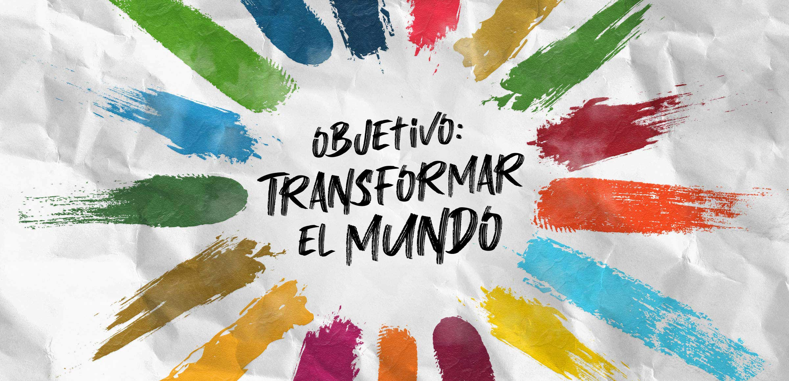
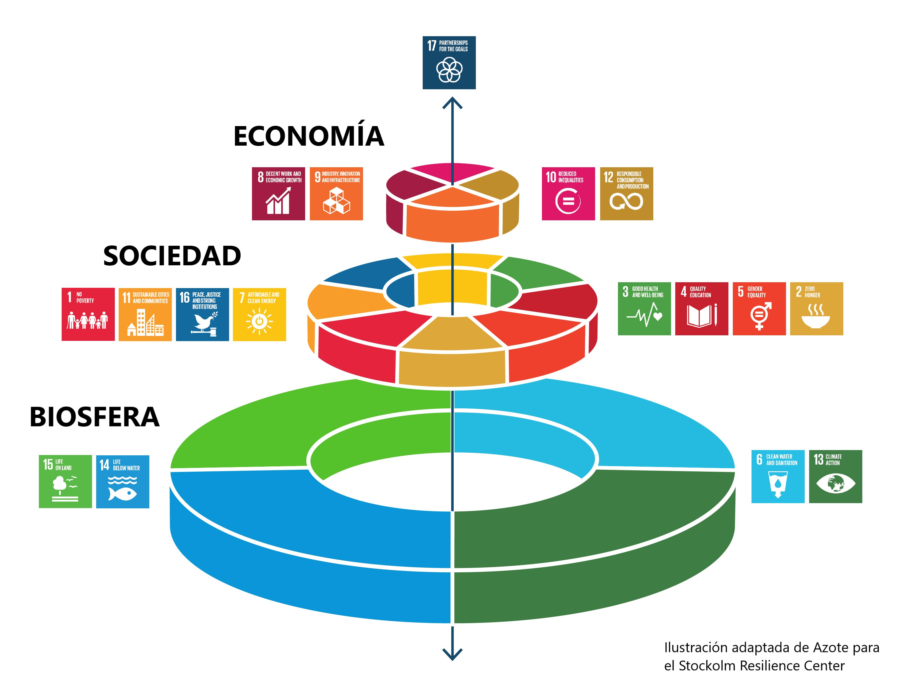

# Agenda 2030 y las ODS

La agenda 2030 se aprueba en septiembre de 2015, con el objetivo de abordar los desafíos mundiales más apremiantes, como lo son: la pobreza. el hambre, hasta la corrupción y el cambio climático.

---

## La agenda 2030 está formada por 17 objetivos de desarrollo sostenible(ODS), los cuales son:

  1. Fin de la pobreza: Erradicar la pobreza en todas sus formas.
  2. Hambre cero: Poner fin al hambre, lograr la seguridad alimentaria y mejorar la nutrición.
  3. Salud y bienestar: Asegurar una vida sana y promover el bienestar para todos.
  4. Educación de calidad: Garantizar una educación inclusiva y de calidad para todos.
  5. Igualdad de género: Lograr la igualdad de género y empoderar a todas las mujeres y niñas.
  6. Agua limpia y saneamiento: Asegurar la disponibilidad y gestión sostenible del agua y el saneamiento.
  7. Energía asequible y no contaminante: Asegurar el acceso a energía asequible y sostenible.
  8. Trabajo decente y crecimiento económico: Promover el crecimiento económico sostenido e inclusivo.
  9. Industria, innovación e infraestructura: Construir infraestructuras resilientes y fomentar la innovación.
  10. Reducción de las desigualdades: Reducir la desigualdad en y entre los países.
  11. Ciudades y comunidades sostenibles: Hacer que las ciudades sean inclusivas y sostenibles.
  12. Consumo y producción responsables: Asegurar modalidades de consumo y producción sostenibles.
  13. Acción por el clima: Adoptar medidas urgentes para combatir el cambio climático.
  14. Vida submarina: Conservar y usar sosteniblemente los océanos y recursos marinos.
  15. Vida de ecosistemas terrestres: Proteger y restaurar los ecosistemas terrestres.
  16. Paz, justicia e instituciones sólidas: Promover sociedades pacíficas e inclusivas y garantizar el acceso a la justicia.
  17. Alianzas para lograr los objetivos: Fortalecer la cooperación y revitalizar la Alianza Mundial para el Desarrollo Sostenible.

   
 
  ---
  
  ## ¿En qué órgano de la ONU se debate sobre los ODS?

  los debates sobre los ODS se dan en varios órganos de la ONU, pero la Asamblea General (Asamblea General de las Naciones Unidas. Este órgano está compuesto por todos los Estados miembros de la ONU (193 países) y es el principal foro donde se discuten y adoptan decisiones sobre una amplia gama de temas globales, incluidos los ODS) y el HLPF ( Foro Político de Alto Nivel sobre el Desarrollo Sostenible (HLPF), que se celebra anualmente y proporciona una plataforma para revisar el progreso en la implementación de los ODS a nivel global) son los más relevantes.

  
